Taking advantage of attending the 2020 PostgreSQL China Conference, I toured Guangzhou for a day. A quite interesting place.

Among the four first-tier cities, only Guangzhou remained unvisited. This time, leveraging the PG conference opportunity, I booked a flight one day later to remedy this regret. Though making it literary would be nice, it's too time-consuming, so I'll just keep a journal.

## Prelude: PG Conference

Arrived in Guangzhou on January 14th, staying at the conference venue hotel Wanfu Hilton. During the pandemic, inspections along the way were quite strict, forming sharp contrast with Beijing's sheep-herding style management. During check-in, they required scanning health codes first, then communication big data travel cards, plus filling out a paper registration form with personal information. Next came scanning a "Sanyuanli Police Station" mini-program to declare purpose of coming to Guangzhou, itinerary, household registration and other miscellaneous related information. Finally...

As an "open" city, this truly astonished me. Because this inspection intensity surpassed even Xinjiang. I don't know if these were temporary pandemic measures or normalized management methods. After wasting over ten minutes at the front desk with various registrations, they finally let me check in. Fortunately the front desk was considerate - seeing they'd hassled me so long, directly upgraded me to a free executive suite for free. Not bad at all.

January 15th and 16th was attending the PG conference. Despite the serious pandemic, attendance was surprisingly high. Unexpected, but also demonstrated PostgreSQL's genuine popularity. My main presentation was second day afternoon; originally I thought I could sneak out the first day and second morning to wander around Guangzhou city, returning just before my slot.

But due to insufficient on-site volunteers, the community pressed me into service too. Responsible for front desk registration, distributing souvenirs, collecting community-issued licenses for friends and two companies, plus being session chair for my own track - first time doing these things was quite fun.

I shared a presentation called "Pigsty," mainly introducing the world's strongest open-source PostgreSQL monitoring system Pigsty that I wrote. What made me proud was that while many presentations put audiences to sleep, mine received enthusiastic applause. After all, such good stuff could be sold for money, but I open-sourced it with love - some applause is deserved.


> 2020 PostgreSQL China Conference group photo - sorry, I took center stage (the Buddha-style pose one)

Anyway, after presenting, the PG conference was winding down. Already 6 PM on the 16th, I'd booked a 6 AM flight on the 17th, leaving me exactly one whole hour. So where to have some fun?

## Shamian: European Style

Chatting with taxi drivers, I already had a rough idea of Guangzhou's worth-visiting places. So I went directly to **Shamian**. Shamian is a fascinating place - the Opium War cannons were fired here too. Formerly British-French concession territory, it's a living European architecture museum.

Arriving at 6 PM, walking into the district, an elegant graceful atmosphere hit me. Every building here is exquisite, possibly with 100-200 years of history. Lush plane trees beside buildings cast brilliant golden light under street lamps - quite beautiful.


> Golden plane trees

Sky slightly tipsy, night slightly cool. I played Hacken Lee's "Moon Half Serenade," strolling Shamian's streets. Breeze on face, spirits soaring. Walking along, my earphones seemed to have some bass - removing them revealed a roadside café playing the same song, creating a wonderful feeling in my heart.


> Carefully maintained flower beds

Shamian has a delicate small church, unfortunately due to pandemic, religious activities stopped and the church was closed. Otherwise I really wanted to see what this beautiful church looked like inside. Streets had many couples, walking hand in hand, whispering intimately, making one envious.

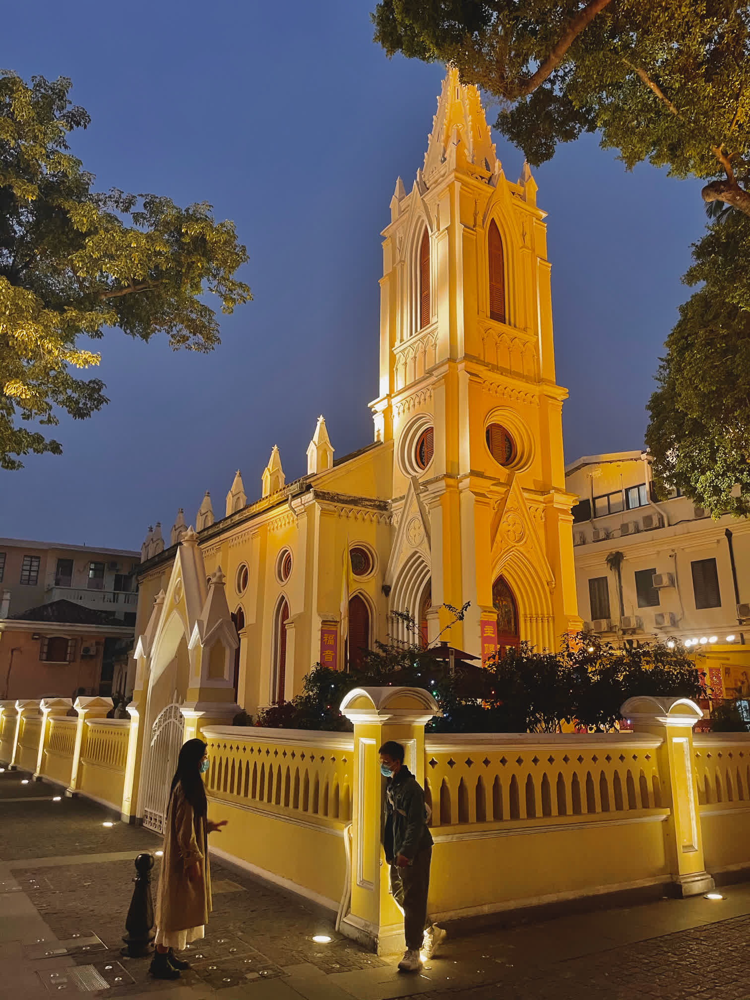
> Shamian Church in the night

Wandering Shamian awhile, this elegant European atmosphere was captivating, though after an hour I was somewhat tired. I'd booked 7:30 PM Pearl River night cruise tickets - now exactly 7 o'clock, I needed to quickly fill my stomach. Wanted to find a Burger King to make do, but only a French restaurant nearby - Orient Express. Though the atmosphere was nice, I could only order the quickest dish to catch the boat.

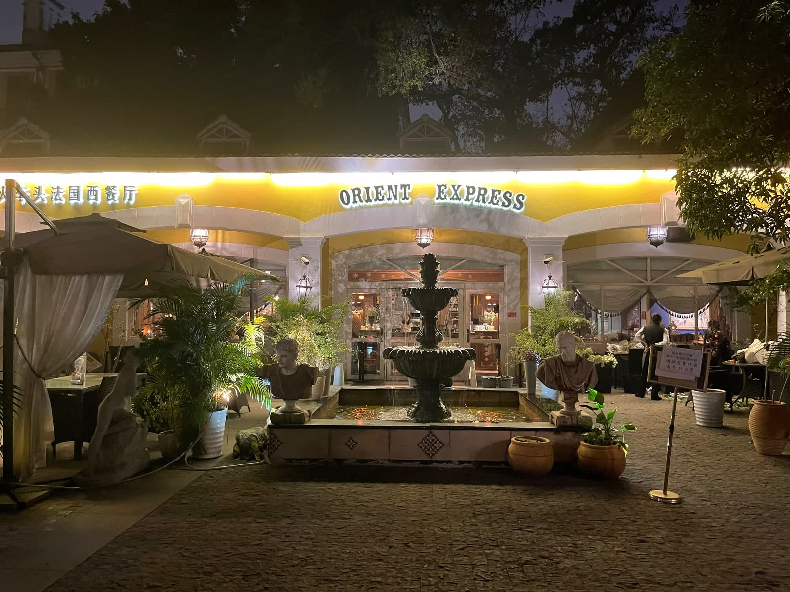

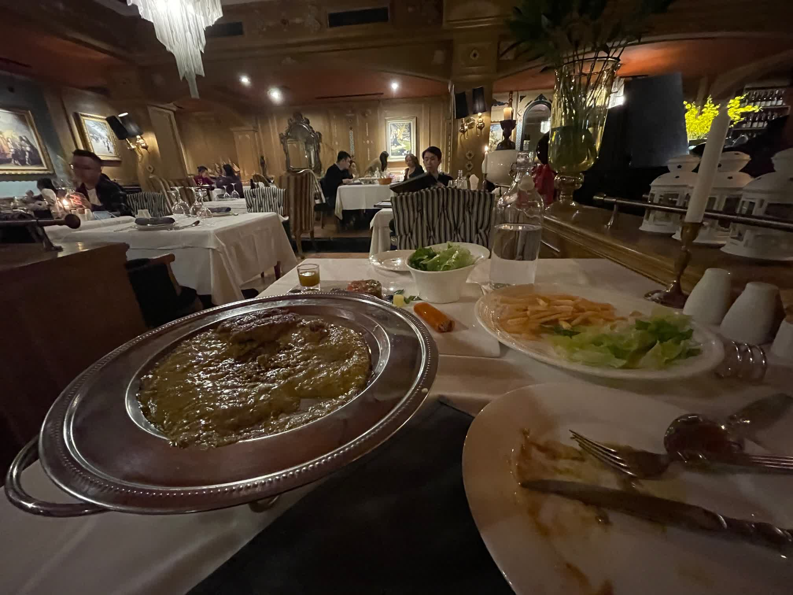

7:30 PM, I boarded the cruise right on time. The Pearl River under night sky was illuminated golden by lights from both banks.

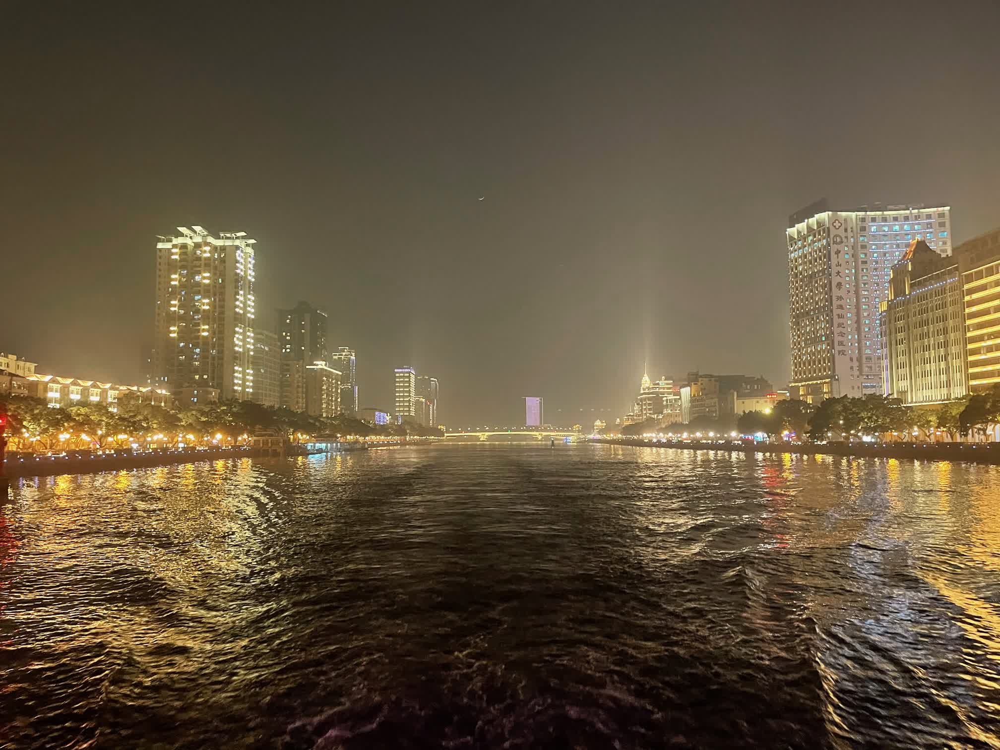

> See how bright the evening stars shine with golden light. Sea breeze blows, blue waves ripple.
> 
> Under the Milky Way, twilight vast. Sweet songs float in the distance.
> 
> See how beautiful the small boat, floating on the sea. Rising with gentle waves, swaying with clear wind.
> 
> All sounds silent, earth enters dreamland. In quiet deep night, bright moon shines everywhere.

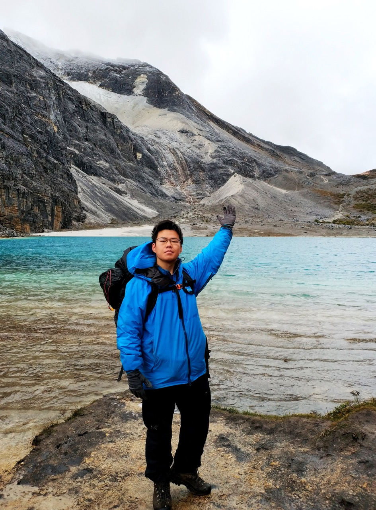

Passing Guangzhou Tower "Small Waist," couldn't avoid taking a tourist photo. Guangzhou Tower at night was flashy, with huge scrolling text including socialist core values - couldn't help but criticize this aesthetic. Finally caught a shot when text finished scrolling.

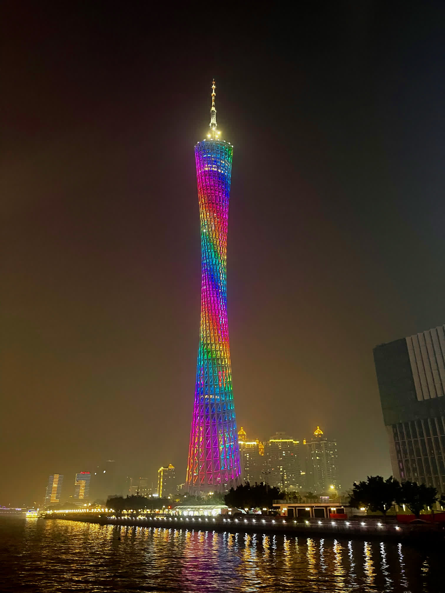

> Guangzhou Tower - actually quite spectacular viewed from below.

Sometimes I think these new landmarks and buildings look blingbling very flashy, yet always give a nouveau riche or boorish aesthetic feeling, especially compared to concession architecture. Domestically, aesthetics still lag several levels behind Europe.

Originally wanted to find a hotel near Guangzhou Tower to stay, so next day could directly visit Guangdong Provincial Museum.
But later reconsidered - better return to Shamian to stay, experience concession atmosphere and have morning tea. So I took the boat back.

Evening returned preparing to find food, so went to commercial area near Shamian. Ate at Cai Lan Hong Kong dim sum - taste was okay. The plaza had a DJI store, went in for a look and chatted quite well with the staff - also an outdoor enthusiast, Xinjiang guide. He mentioned DJI has a Mavic 2 enterprise advanced version with infrared camera, megaphone and flashlight, around 16k. Honestly at 15k I really wanted to get one on the spot, but discovered enterprise version was 36k - that's a bit pricey...

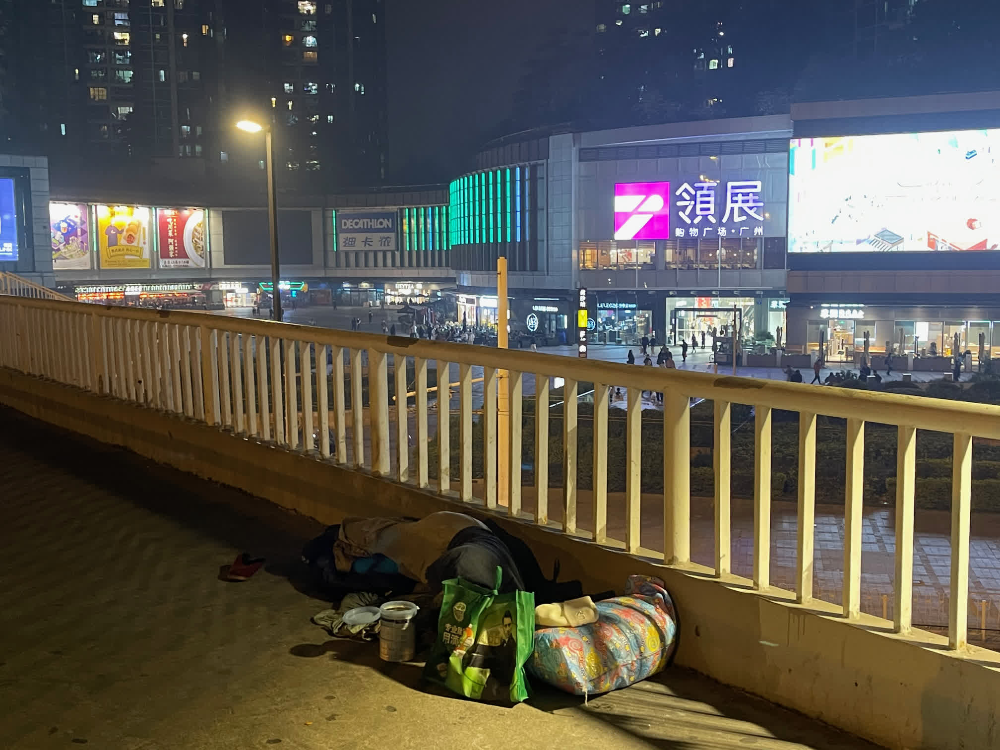

On the plaza entrance bridge lay a homeless person, contrasting sharply with the elegant European-style district and magnificent commercial plaza nearby, reminding passersby how many people still live in miserable conditions. But such scenes unlikely in Beijing, because Beijing's cold waves hit -20°C - anyone daring to sleep rough on Beijing streets this season would freeze to death. I think Shenzhen becoming a startup capital isn't without reason - even if startup fails, worst case can be a Sanhe Great God sleeping under bridges. In the north, one might consider freezing to death.

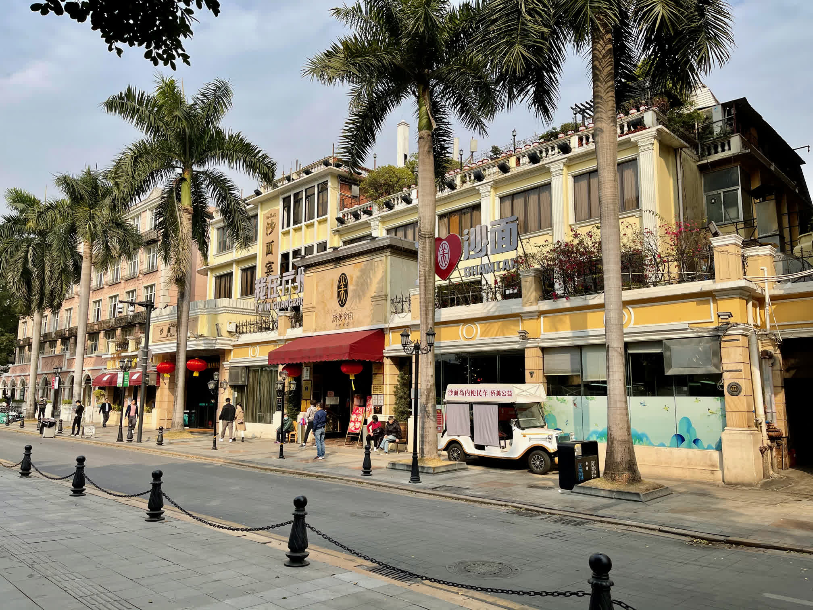

For evening accommodation I chose Shamian Hotel. Though the rooms were quite rustic, internal facilities were lacking. Most unpleasant experience was Guangzhou's overly strict check-in - hearing I came from Beijing Chaoyang District, though theoretically no longer an epidemic zone, just hearing "Beijing" immediately triggered household registration mode. First all the codes routine, then several forms, then downloading police station mini-program declarations, finally reporting every day's itinerary for the past 14 days... Most excessive was 11 PM phone call waking me saying they'd reported my information up, discovered I'd been to Yunnan two weeks ago but didn't declare - I said that was exactly 15 days ago so I didn't fill it. I somewhat understood Hubei people's treatment and feelings back then.

## Day Two: Shamian Morning

Morning woke up, went to Qiaojia Cuisine at the entrance for morning tea - reportedly an old established famous restaurant. But traveling alone's biggest sadness is you can only eat two or three dishes. I ordered four and was nearly stuffed to death.

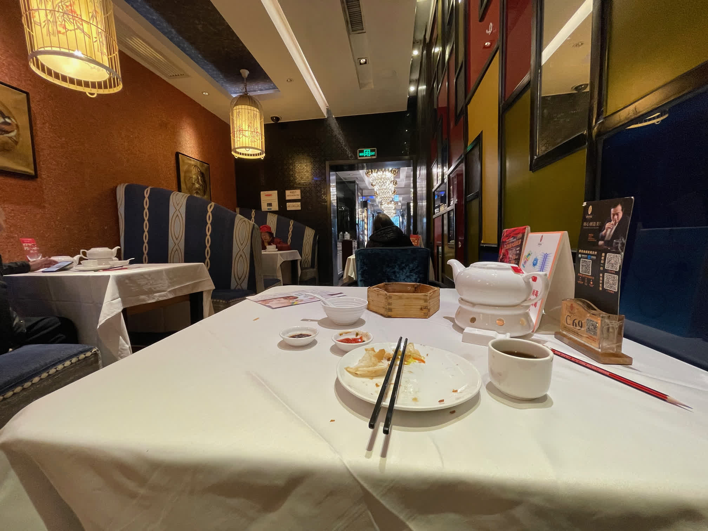

Guangzhou morning was quite pleasant; morning Shamian compared to night scene showed different charm. Morning exercising elders, Sunday activity school children - all displayed vibrant scenes. I still envied locals living here.

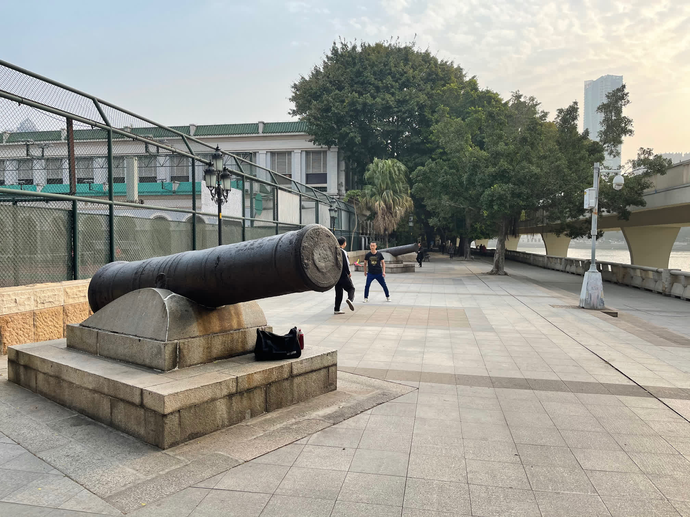

> Qing army cannon on Shamian Island (barrel sealed shut)


> Postal Museum - unfortunately closed.

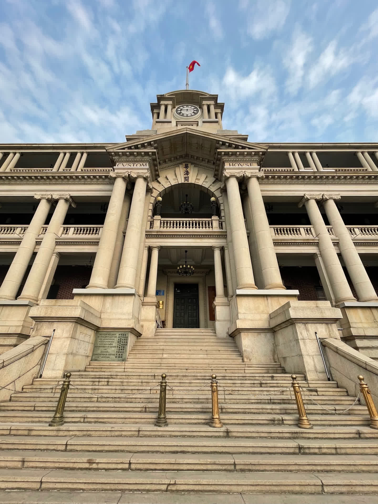
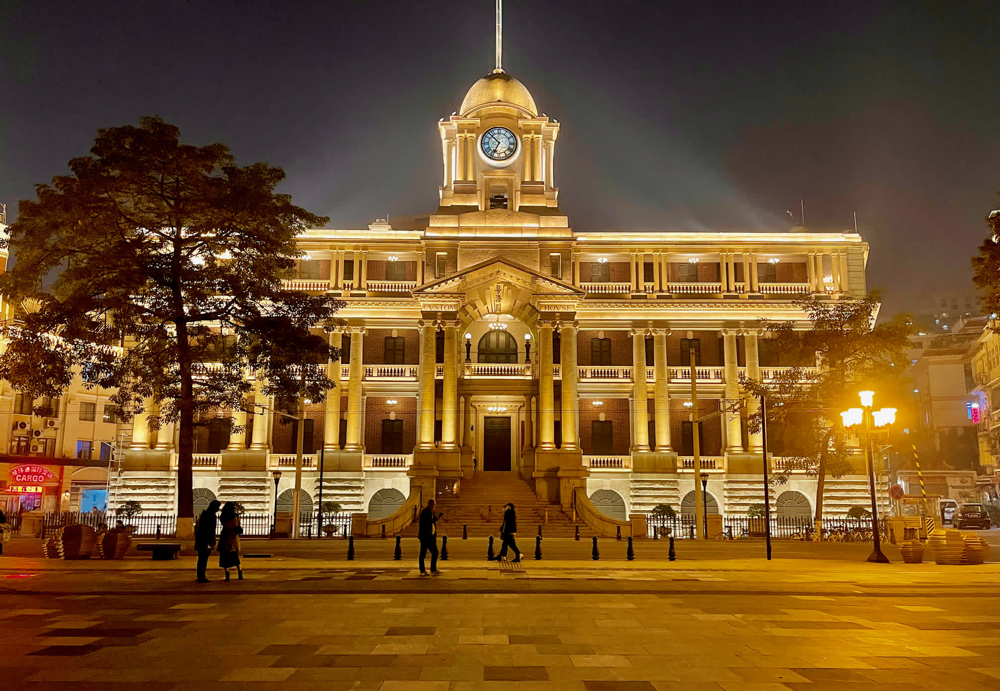
> Guangdong Customs, day and night

Most atmosphere-destroying on Shamian Island were propaganda slogans everywhere - like psoriasis and dog skin plasters, completely ignoring context, scattered everywhere.

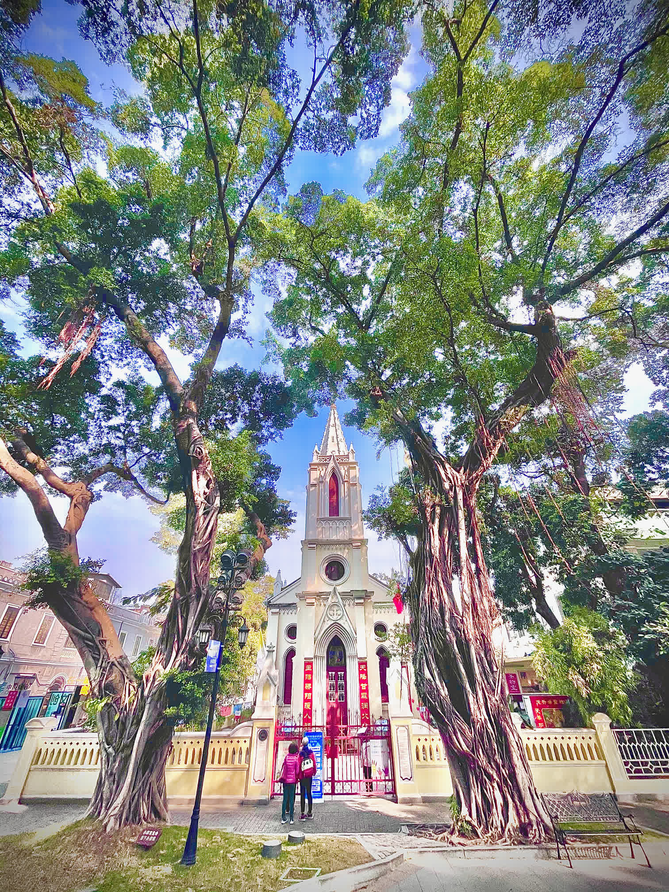
> Yesterday's church - looks very different in daylight

## Museum Tour

Morning's first stop was Thirteen Hongs Museum - the former monopoly trade institution with many Qing dynasty artifacts. Besides pots and pans, many Western treasures and interesting imported items - among museums I've visited, quite interesting.

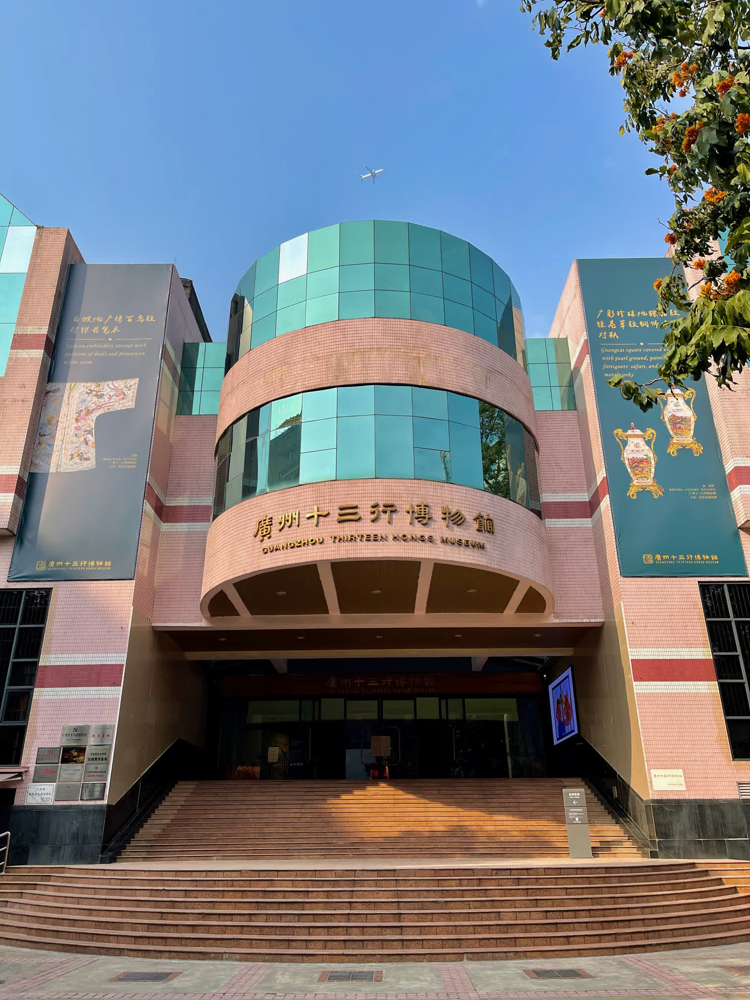

> Building looks unremarkable but quite interesting.

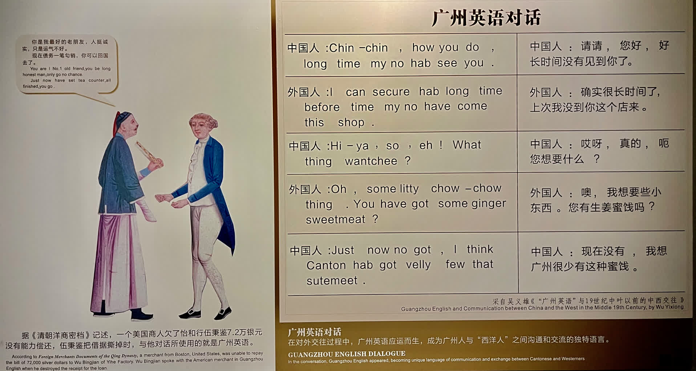

> Of course, most amusing was Guangzhou English - rivaling pidgin English.


Next was Guangzhou Museum. Guangzhou Museum requires reservations - somewhat troublesome, but exhibits were good. Last year reportedly Zhang Xianzhong's Jiangkou sunken silver special exhibition was here - missing it was regrettable.

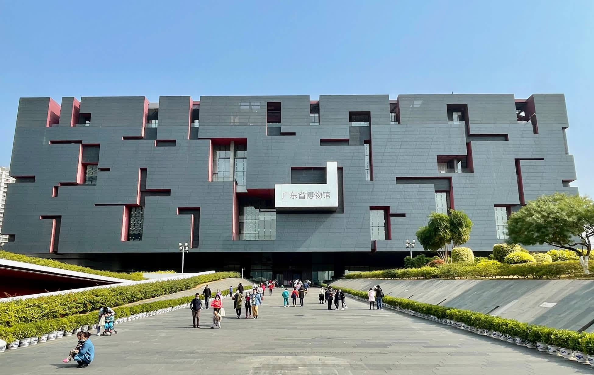

Inside was a wood carving and silk exhibition, quite interesting.

What made me happy was this museum shop actually sold beautiful minerals - never seen other places sell them. 1 yuan per gram, I picked a jin (500g) of various polished minerals. Though useless, beautiful shiny stones are just delightful to see - like dragons seeing treasure.

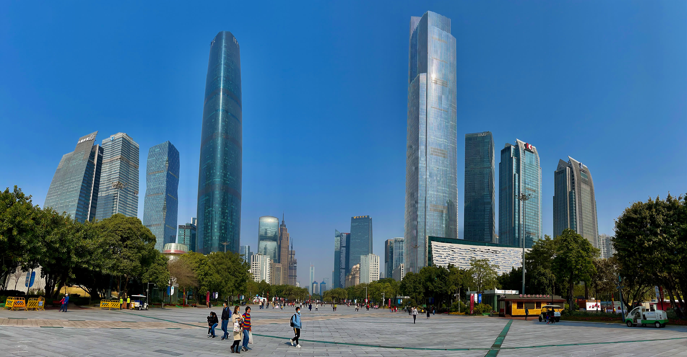

Outside the museum is Huacheng Plaza, quite beautiful - after all Guangzhou is a first-tier city.

Across from Huacheng Plaza is Guangzhou Tower, aka "Small Waist." Saw it yesterday by boat, heard you can go up - so let's ascend for a sky view.

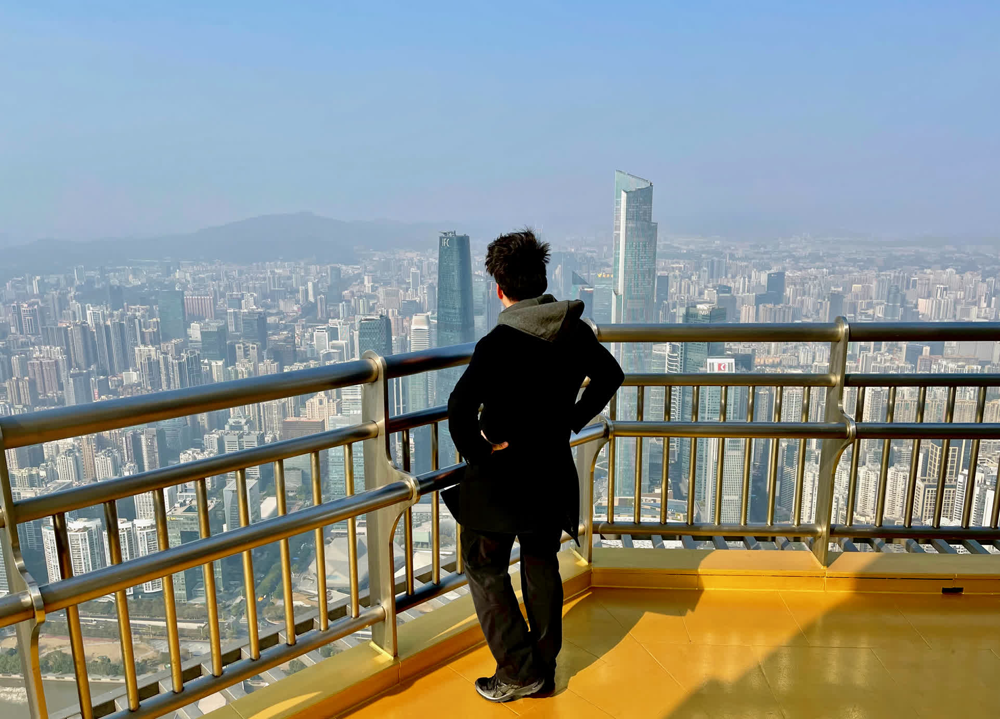

> Bird's eye view of Guangzhou city - quite spectacular.


Coming down from Small Waist was already 3 PM. Originally wanted to visit Western Han Mawangdui Han Tomb Museum too, but ran out of time.

## Other

Well, just casual writing. Next comes technical time - too many photos waste bandwidth. How to handle 100MB photos? Putting them on blogs wastes everyone's (and my own) bandwidth - quite ungentlemanly behavior.

So need compression. I prefer scaling length/width to half original - 100MB photos compress to 6MB, excellent effect with barely visible difference.

```bash
ffmpeg -i shamian-2.jpg -vf "scale=iw*.5:ih*.5" temp/shamian-2.jpg
```

```bash
for src in *.jpeg; do
  dst="new/${src%.*}.jpg"    # Original name + .jpg

  ffmpeg -hide_banner -loglevel error -y -i "$src" -vf "scale='if(gt(iw,1600),1600,iw)':-1:flags=lanczos" -q:v 5 "$dst"
  echo "✓  $src  →  $dst"
done
```