借着参加2020PostgreSQL中国大会的机会，顺便在广州逛了一天。还是很有趣的地方。

四个一线城市中，唯有广州没有去过。这次趁着开PG大会的机会，定了晚一天回去的机票，准备弥补一下这个遗憾。弄的文艺一点虽然不错，但太费时间了，所以我还是记个流水账吧。


## 前戏：PG大会

1月14号到的广州，住在PG大会会场酒店万富希尔顿。疫情期间，一路上的盘查都很严格，跟北京的放羊式管理形成鲜明的对照。入住的时候，要求我先扫健康码，然后是通信大数据行程卡，还要在一份纸质登记表上写下自己的信息。接下来要扫一个“三元里派出所”的小程序，申报来广州的目的，行程，以及户口等乱七八糟的相关信息。最后，

作为一个“开放”的城市，这着实让我感到十分诧异。因为这种盘查力度，比新疆还有过之无不及。我不知道是因为疫情而设立的临时措施，还是一种常态化的管理方式。在前台浪费了十几分钟进行各种登记后，总算能让我住店了。好在前台也很体贴，看到折腾了我这么久，直接给我免费升了一个行政套房，啧啧，还是不错的。

15号和16号就是参加PG大会了，尽管疫情这么严重，但参会但人数还是非常多。有点出乎意料，但这也从一方面说明了PostgreSQL确实火爆起来了。我的主讲会场在第二天下午，本来我的想法是第一天和第二天上午可以出去摸个鱼，去广州城里玩一圈，快到我了再回来。
结果因为现场的志愿者不够，我也被社区抓了壮丁。负责前台参会签到，发放纪念品，替朋友和两家公司领了社区发的牌照，还当了自己分会场的场控，第一次干这些确实还挺好玩的。

我自己分享了一个名为《Pigsty》的主题分享，主要是介绍自己写的地表最强开源PostgreSQL监控系统Pigsty。让我比较骄傲的一点是，一般的分享很多人都听的昏昏欲睡，但我讲完之后现场响起热烈的掌声。毕竟这么好的东西本来能卖钱，结果开源出来用爱发电，来点掌声也是应该的嘛。

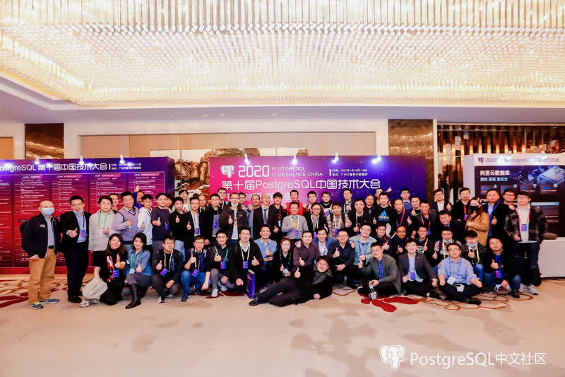

> 2020 PostgreSQL中国大会合影留念，不好意思，C位被我占了（窝佛式那个）

总之，讲完之后，PG大会也到了尾声。已经是16号下午六点了，我定了17号六点的飞机，所以留给我的还有整整一个小时。那么，去哪里耍一耍呢？


## 沙面：欧式风情

跟出租车司机聊天的时候，我已经对广州值得游览的地方大概心里有数了。所以，我就直接打车去了**沙面**。沙面是个很有趣的地方，当年鸦片战争也是在这里打炮的。以前属于英法租界，是一个活生生的欧式建筑博物馆。

到的时候已经是晚上六点了，走进街区，一股雍容典雅的气息扑面而来。这里的每一栋楼都非常精致，可能有着一两百多年的历史。楼旁的梧桐树枝叶繁茂，在路灯的照耀下泛出灿烂的金光，甚是美丽。


> 金黄色的梧桐树

天色微熏，夜意微凉。我放起了李克勤的《月半小夜曲》，漫步在沙面的街道上。清风拂面，心情无比悠扬。走着走着，我感觉耳机似乎有些重音，摘下耳机一听，原来是路边的咖啡厅也在放这首歌，心头不禁浮现起一种奇妙的感觉来。


> 精心修建的花坛

沙面有一座很精致的小教堂，可惜因为疫情，宗教活动都停止了，教堂也关了门。不然我还真想进去看一看这座美丽的教堂里面会是什么样。街道上有很多情侣，携手漫步，耳鬓厮磨，让人心生羡慕。

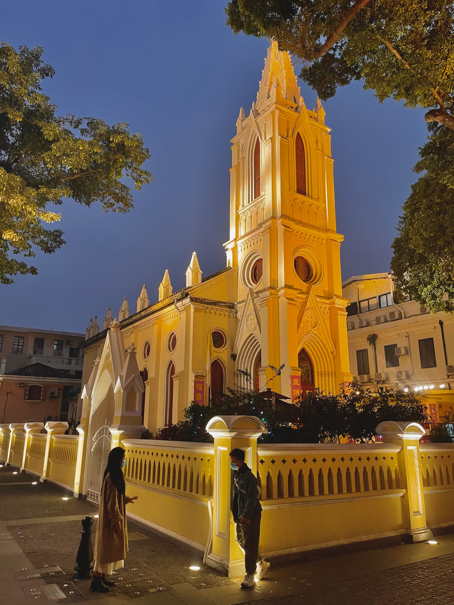
> 夜色中的沙面教堂

在沙面逛了一会，这种典雅的欧式氛围让人流连忘返，不过逛个一个小时也有些乏了。我定了7点半的夜游珠江船票，现在正好七点，我准备找个地方赶快填一填肚子。本想找个汉堡王对付一下，结果附近只有一家法国餐厅，东方快车，虽然气氛很不错，但我也只能叫个最快的菜好去赶船了。

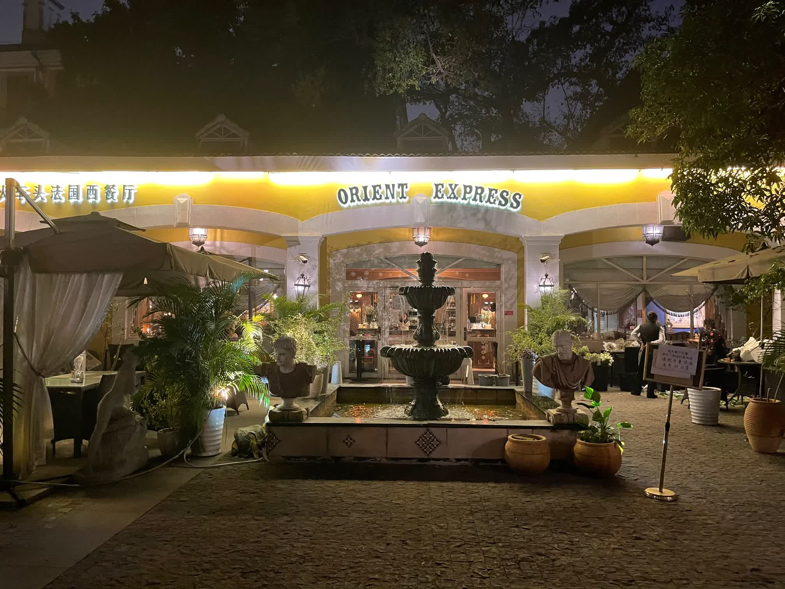


7点半，我踩着点正好上了游船。夜色下的珠江被两岸的灯光照耀的金碧辉煌。

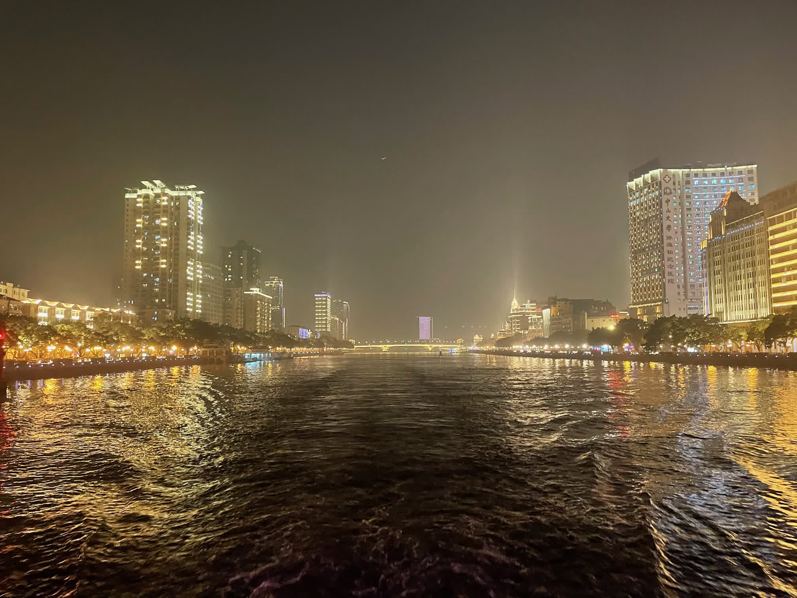

> 看晚星多明亮，闪耀着金光. 海面上微风吹, 碧波在荡漾。
> 
> 在银河下面, 暮色苍茫。甜蜜的歌声，飘荡在远方。
> 
> 看小船多美丽，漂浮在海上。随微波起伏，随清风荡漾。
> 
> 万籁皆寂静，大地入梦乡。幽静的深夜里，明月照四方。


路过广州塔小蛮腰，还是难以免俗排了一张游客照。夜色下的广州塔花里胡哨，上面还有各种硕大的文本在滚动，社会主义核心价值观之类的，让人难免吐槽这是什么鬼审美啊。好不容易趁文本滚完拍了一张。

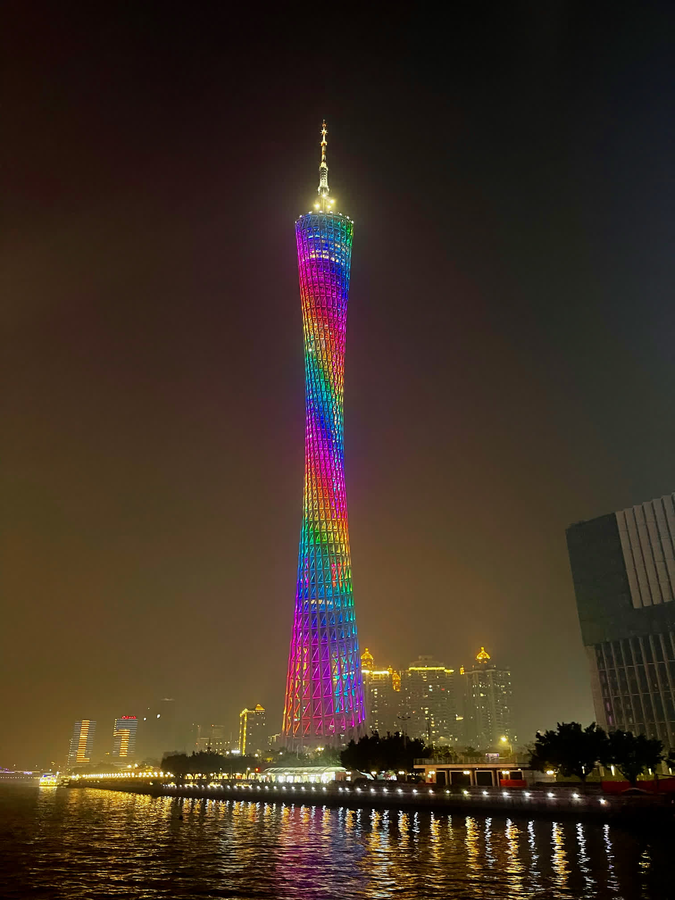

> 广州塔，其实在底下看还蛮壮观的。


其实有时候我在想，这些新弄的地标也好，建筑也好，看上去blingbling非常闪耀，却总给人一种暴发户土财主，或者说土鳖审美的感觉，特别是和租界区的建筑比起来。国内吧在审美这块上感觉比欧洲还是差了好几个档次。

本来我想在广州塔附近找个酒店住下，这样第二天就可以直接去看广东省博物馆了。
不过后来转念一想，还是回沙面去住吧，体验一下租界风情，再吃个早茶。于是我就坐船回去了。

晚上回去准备找点东西吃，所以去了沙面附近的商业区。吃了个蔡澜港式点心，味道还行吧。广场里有一家DJI店，进去逛了一下，和店员小哥聊了一聊还挺投缘的，也是个户外爱好者，新疆领队。听他说DJI有一款Mavic 2的企业进阶版，带有红外相机，喊话器和闪光灯，1w6左右。说实话一万五的话我还真想当场搞一个，结果最后发现企业版是3w6，那还是有点贵了……。

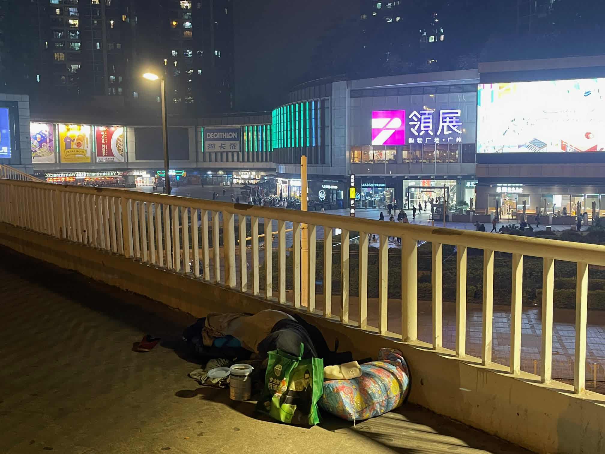

商业区门口的天桥上躺着一位流浪汉，和旁边典雅的欧式风情街区和富丽堂皇的商业广场显得格格不入，提醒着路过的人们究竟还有多少人生活在一种悲惨的状态种。不过这种景象不太可能会在北京看到，因为北京寒潮零下20摄氏度，这个季节敢在北京露宿街头的肯定得冻死了。我想，深圳成为创业之都也不是没有道理，毕竟这里就算创业失败最烂还可以当三和大神睡天桥，在北方可能要考虑的就是会不会冻死的问题了。

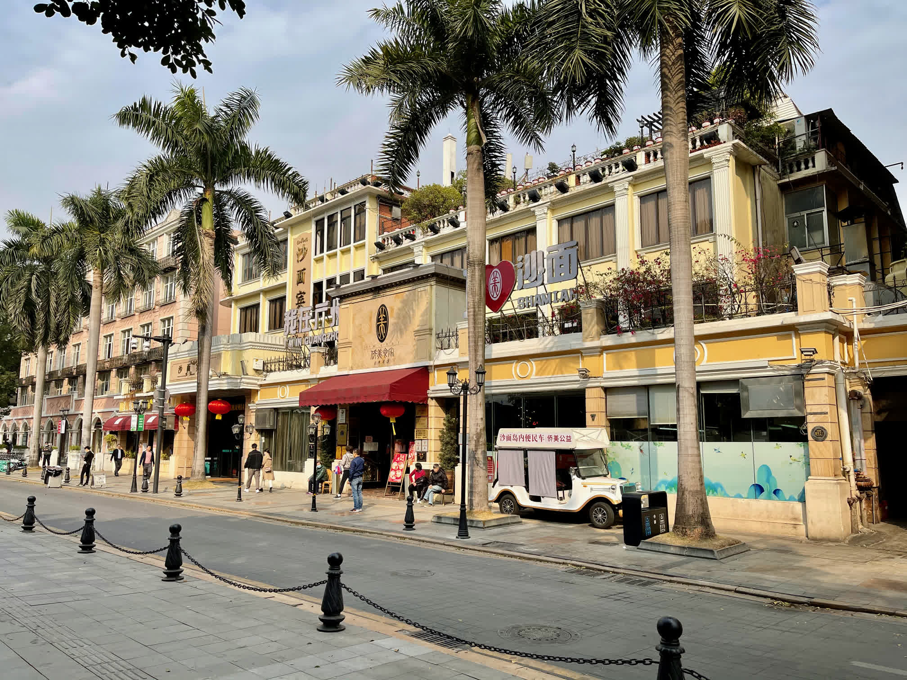

晚上的住宿我选在了沙面宾馆，虽说屋子还是挺古朴的，但里面的设施还是有点差劲的。最令人不悦的体验就是在广州入驻实在是太严格了，一听我是北京朝阳区过来的，虽然理论上已经不是疫区了，但只要一听到是北京来的，马上就进入查户口模式。首先是各种码来一套，然后填了好几份表格，接下来下载派出所小程序申报，最后让你汇报最近14天每一天的行程。。最过分的是晚上十一点电话call醒我说，哎呀我们把你的信息上报上去啦，检查到你两周前去过云南，你怎么没有申报呀，我说那正好是15天前所以没填。我算是有点儿理解湖北人当初的待遇和感受了


## 第二天：沙面的早晨

早晨起来，去门口的侨家美食吃了个早茶，据说这还是一家老字号名店。不过一个人出来玩最大的悲伤就是，你只能吃下两三样菜。我点了四样，就已经快撑死了。

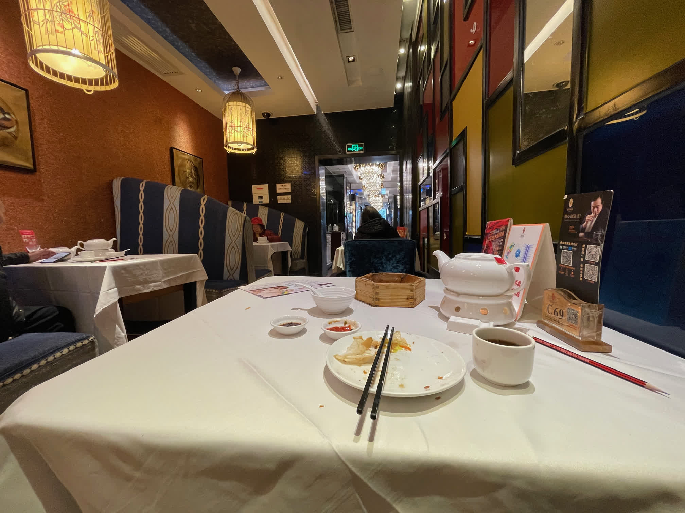

早晨的广州相当惬意，早上的沙面与夜景相比又是另一种风情。晨练的老人，周日活动的小学生们，都展现出一副生机勃勃的画面。我还是有点羡慕住在这里的本地人的。

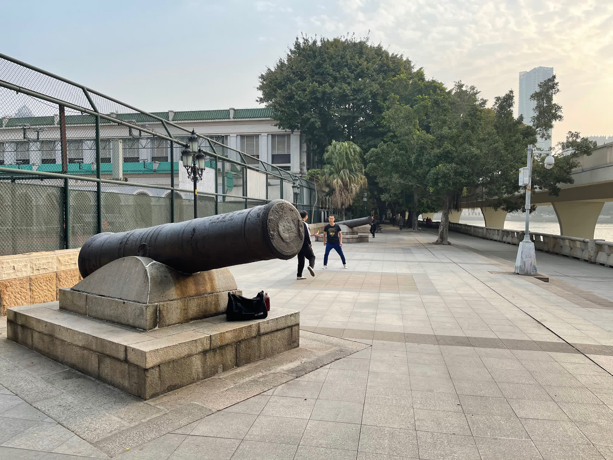

> 沙面岛上的清军大炮（炮眼都被钉死了）


> 邮政博物馆，可惜关门了。


> 粤海关，白天和晚上


沙面岛上最破坏气氛的，就是遍地都是的宣传标语了，就跟牛皮藓跟狗皮膏药似的，一点也不看场合，漫天遍野都是。


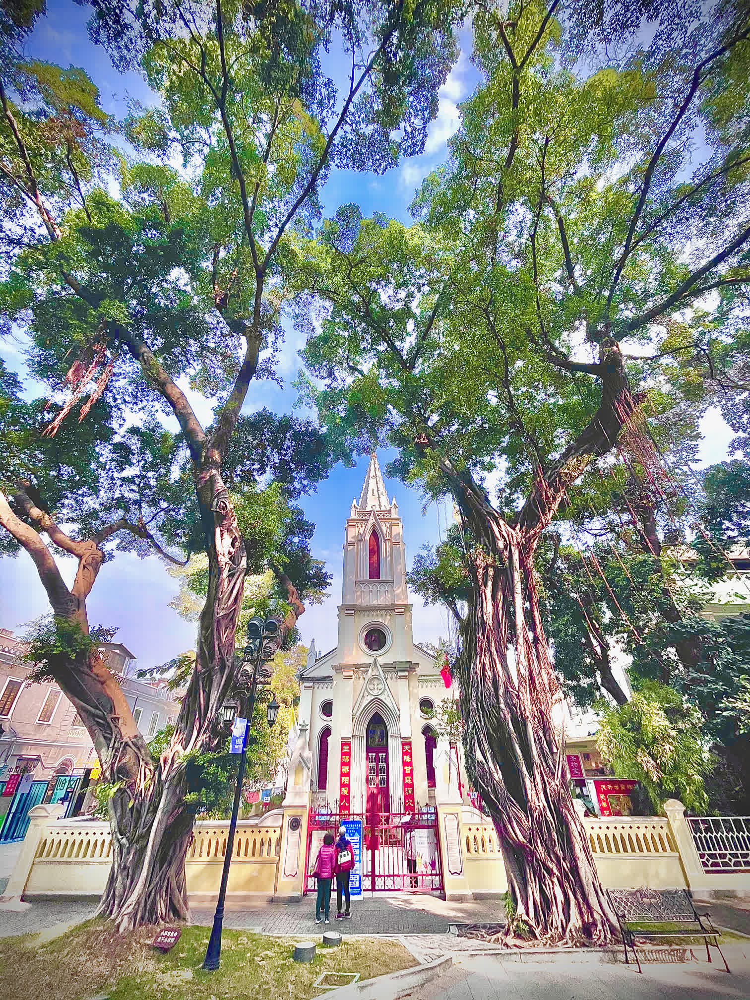
> 昨天的教堂，白天看上去又是大不一样


## 博物馆之旅

早晨的第一站是十三行博物馆，十三行就是以前的垄断贸易机构，有很多清代文物，除了锅碗瓢盆之外，有很多西洋来的奇珍异宝，各种有趣的进口物件，我觉得在我参观过的博物馆里算相当有趣的一个了。


> 楼虽其貌不扬，但还是很有趣的。


> 当然，最搞笑的还是广州英语啦，跟洋泾浜英语有一拼。


 接下来便是前往广州博物馆。广州博物馆需要预约，还有点麻烦，里面的展品也不错。去年据说张献忠江口沉银特展还到这里展出过，错过了甚是可惜。


里面有一个木雕和丝绸的展览，比较有趣。

令我开心的是，在这个博物馆的商店里竟然有卖漂亮的矿石，之前还从来没见过有其他地方卖过的。1块钱1克，我就挑了一斤各式各样的抛光的矿石，虽然没啥用，但美丽闪亮的石头看着就是高兴，就跟巨龙看到财宝一样。

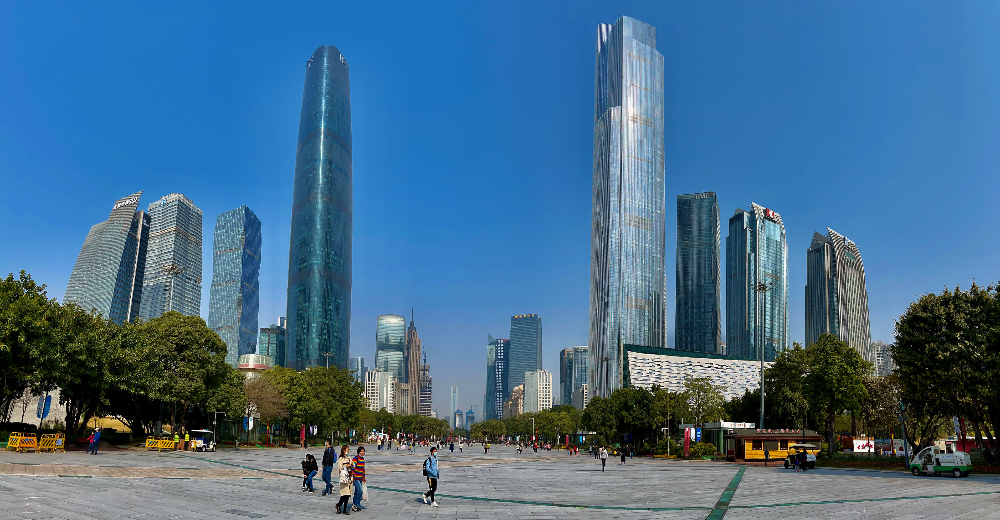

博物馆外面是花城广场，还是挺漂亮的，毕竟广州也是一线城市嘛。


花城广场的对边就是广州塔，又名“小蛮腰”。昨天坐船来这里看过一次，听说这塔可以上去，那就上天看看。

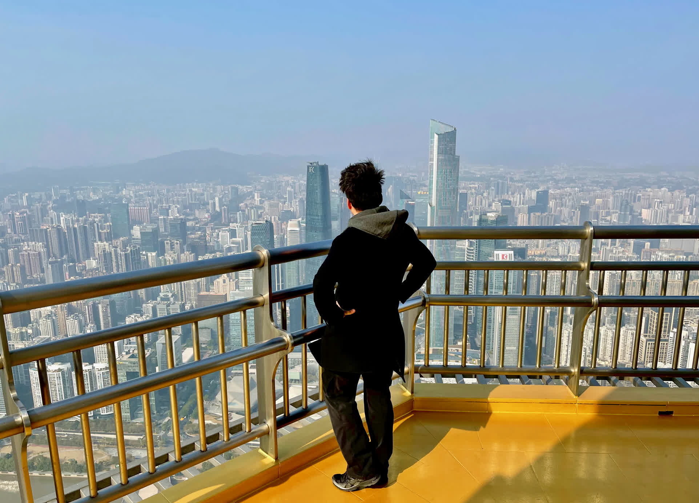

> 鸟瞰广州城，还是蛮壮观的。


从小蛮腰上下来已经是下午三点了。本来还想去西汉马王堆汉墓博物馆看看的，不过时间来不及了。


## 其他

好了，也就是随便写写。接下来是技术时间，照片太多浪费我流量，怎么半？100MB的照片放到博客上浪费大家的（和自己的）流量是不讲武德的行为。
所以需要压缩一下，我比较喜欢长宽缩放为原来的1/2，结果100MB的照片就压缩成6MB了，效果拔群，看上去区别也不大。

```bash
ffmpeg -i shamian-2.jpg -vf "scale=iw*.5:ih*.5" temp/shamian-2.jpg
```

```bash

for src in *.jpeg; do
  dst="new/${src%.*}.jpg"    # 原名 + .jpg

  ffmpeg -hide_banner -loglevel error -y -i "$src" -vf "scale='if(gt(iw,1600),1600,iw)':-1:flags=lanczos" -q:v 5 "$dst"
  echo "✓  $src  →  $dst"
done
```