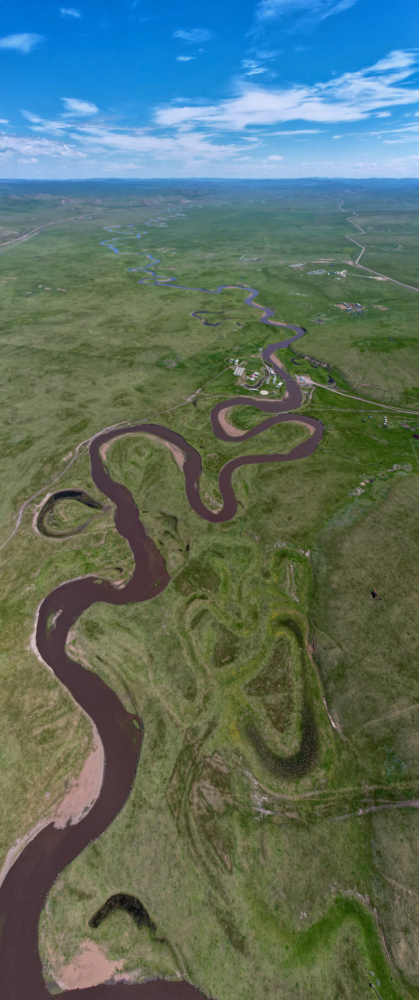
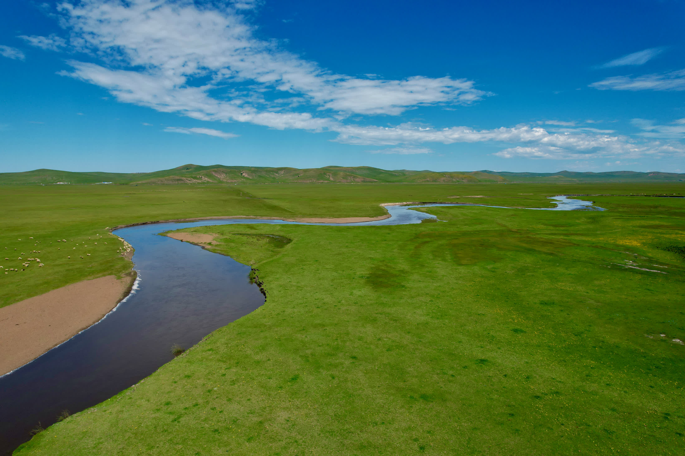
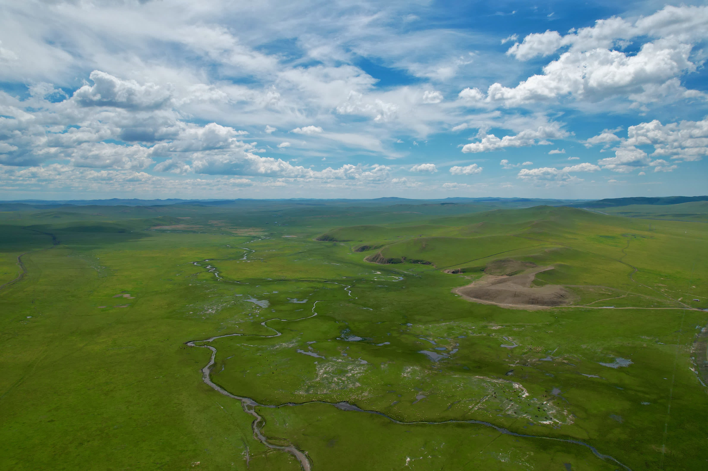
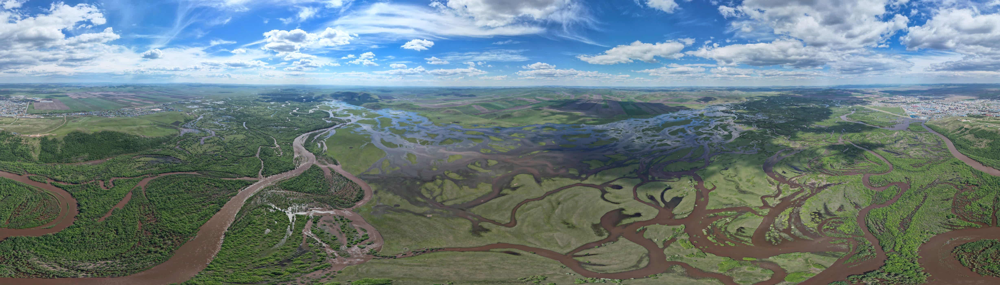
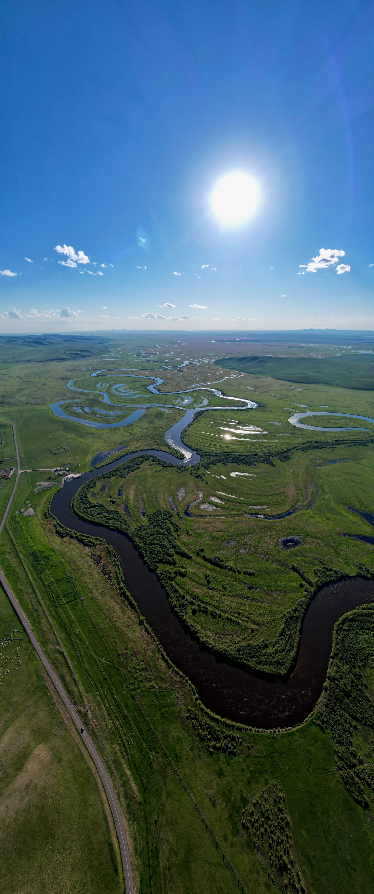
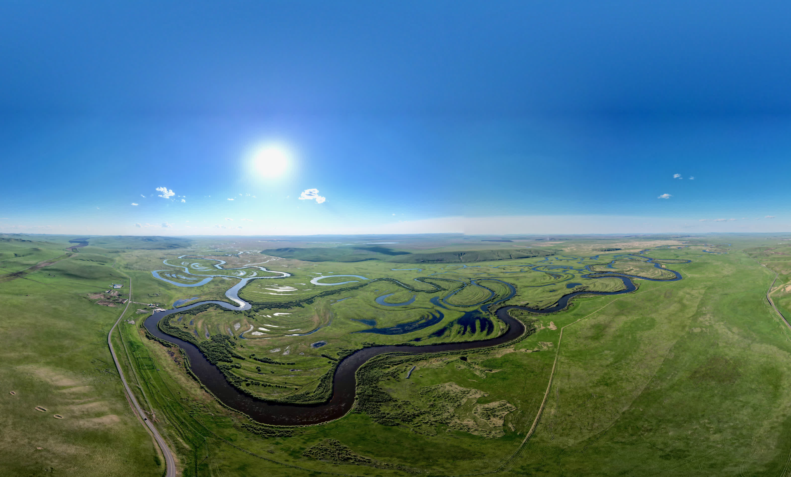
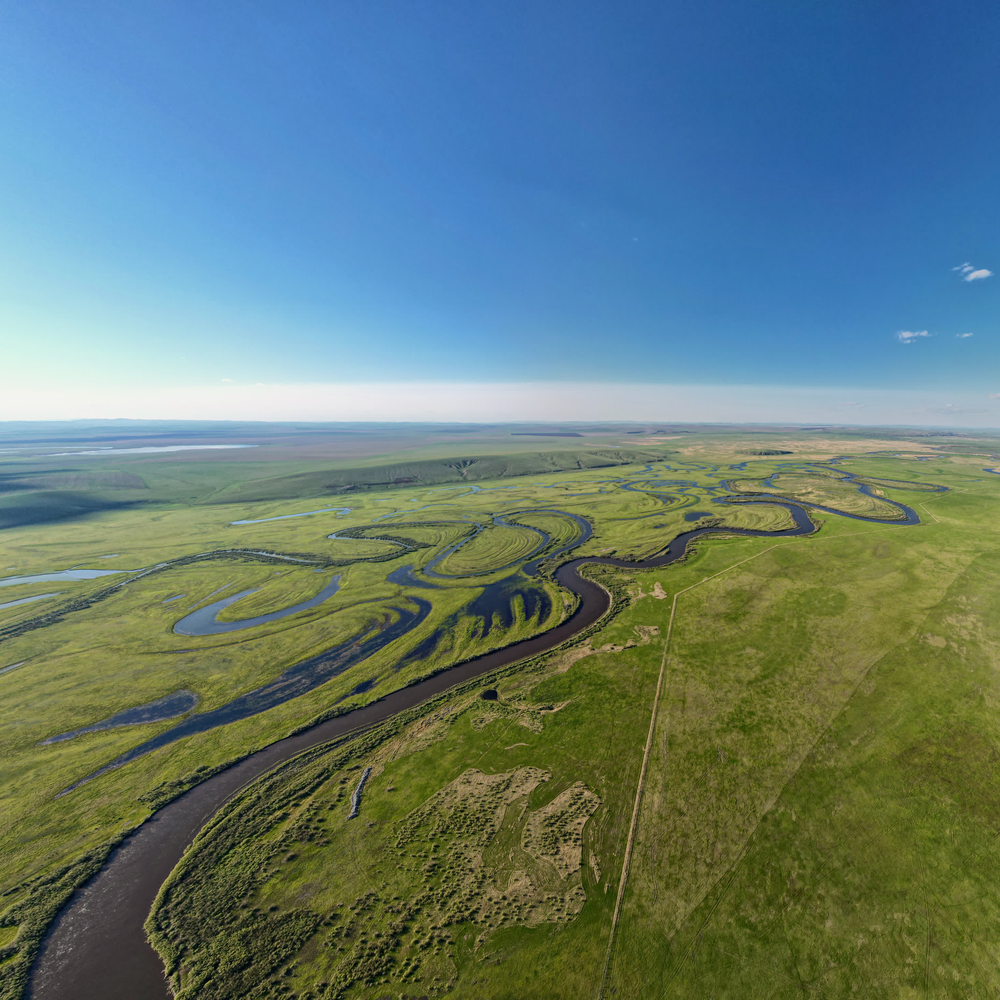

The Dragon Boat Festival holiday coincided with college entrance exams. Not wanting to see crowds everywhere, I discussed with two colleagues and decided to find a weekend for early off-peak travel.

We settled on Hulunbuir - Friday night flight from Beijing to Hailar, returning Monday morning. With major transportation set, we stopped worrying and were too lazy to make detailed plans. Anyway, we'd rent a car there for a spontaneous trip. Hulunbuir is most famous for its grasslands - birthplace of Genghis Khan, reportedly (according to Hulunbuir Municipal Government itself) the world's best grassland. It also has the famous port - Manchuria.

Hulunbuir administratively belongs to Inner Mongolia, bordering Mongolia and Russia, part of the broader "Northeast" region. In fact, this area did belong to Heilongjiang for a period historically.

Usually visiting here requires 6-7 days minimum. Unfortunately our time was tight - only two days and three nights - so we could only tour the most essential parts. Thus we decided: first day head north, second day to Manchuria, third day straight to airport.

Hailar has an airport - Dongshan Airport, very close to downtown.

