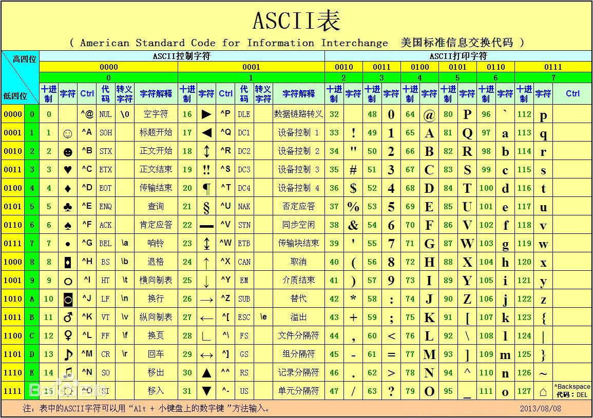

# ASCII码表

## 概述
ASCII是American Standard Code for Information Interchange的缩写，美国信息交换标准代码。它是现今最通用的单字节编码系统。



## ASCII字符集

| Bin | Dec | Hex  | Ctrl | 缩写/字符 | 解释 |
| --- | --- | ---- | ---- |-------- | --- |
| 00000000  | 0    | 00 | @ | NUL(null) | 空字符`\0`  |
| 00000001  | 1    | 01 | A | SOH(start of headling) | 标题开始  |
| 00000010  | 2    | 02 | B | STX (start of text) | 正文开始  |
| 00000011  | 3    | 03 | C | ETX (end of text) | 正文结束  |
| 00000100  | 4    | 04 | D | EOT (end of transmission) | 传输结束  |
| 00000101  | 5    | 05 | E | ENQ (enquiry) | 请求  |
| 00000110  | 6    | 06 | F | ACK (acknowledge) | 收到通知  |
| 00000111  | 7    | 07 | G | BEL (bell) | 响铃`\a` |
| 00001000  | 8    | 08 | H | BS (backspace) | 退格`\b`  |
| 00001001  | 9    | 09 | I | HT (horizontal tab) | 水平制表符`\t`  |
| 00001010  | 10   | 0A | J | LF (NL line feed, new line) | 换行键`\n`  |
| 00001011  | 11   | 0B | K | VT (vertical tab) | 垂直制表符`\v` |
| 00001100  | 12   | 0C | L | FF (NP form feed, new page) | 换页键`\f`  |
| 00001101  | 13   | 0D | M | CR (carriage return) | 回车键`\r`  |
| 00001110  | 14   | 0E | N | SO (shift out) | 不用切换  |
| 00001111  | 15   | 0F | O | SI (shift in) | 启用切换  |
| 00010000  | 16   | 10 | P | DLE (data link escape) | 数据链路转义  |
| 00010001  | 17   | 11 | Q | DC1 (device control 1) | 设备控制1 |
| 00010010  | 18   | 12 | R | DC2 (device control 2) | 设备控制2 |
| 00010011  | 19   | 13 | S | DC3 (device control 3) | 设备控制3 |
| 00010100  | 20   | 14 | T | DC4 (device control 4) | 设备控制4  |
| 00010101  | 21   | 15 | U | NAK (negative acknowledge) | 拒绝接收  |
| 00010110  | 22   | 16 | V | SYN (synchronous idle) | 同步空闲  |
| 00010111  | 23   | 17 | W | ETB (end of trans. block) | 传输块结束  |
| 00011000  | 24   | 18 | X | CAN (cancel) | 取消 |
| 00011001  | 25   | 19 | Y | EM (end of medium) | 介质中断  |
| 00011010  | 26   | 1A | Z | SUB (substitute) | 替补  |
| 00011011  | 27   | 1B | [ | ESC (escape) | 溢出/逃离/取消 `\e`  |
| 00011100  | 28   | 1C | \ | FS (file separator) | 文件分割符  |
| 00011101  | 29   | 1D | ] | GS (group separator) | 分组符  |
| 00011110  | 30   | 1E | ^ | RS (record separator) | 记录分离符  |
| 00011111  | 31   | 1F | _ | US (unit separator) | 单元分隔符  |
| 00100000  | 32   | 20 |  | (space) | 空格  |
| 00100001  | 33   | 21 |  | ! |  |
| 00100010  | 34   | 22 |  | " |  |
| 00100011  | 35   | 23 |  | # |  |
| 00100100  | 36   | 24 |  | $ |  |
| 00100101  | 37   | 25 |  | % |  |
| 00100110  | 38   | 26 |  | & |  |
| 00100111  | 39   | 27 |  | ' |  |
| 00101000  | 40   | 28 |  | ( |  |
| 00101001  | 41   | 29 |  | ) |  |
| 00101010  | 42   | 2A |  | * |  |
| 00101011  | 43   | 2B |  | + |  |
| 00101100  | 44   | 2C |  | , |  |
| 00101101  | 45   | 2D |  | - |  |
| 00101110  | 46   | 2E |  | . |  |
| 00101111  | 47   | 2F |  | / |  |
| 00110000  | 48   | 30 |  | 0 |  |
| 00110001  | 49   | 31 |  | 1 |  |
| 00110010  | 50   | 32 |  | 2 |  |
| 00110011  | 51   | 33 |  | 3 |  |
| 00110100  | 52   | 34 |  | 4 |  |
| 00110101  | 53   | 35 |  | 5 |  |
| 00110110  | 54   | 36 |  | 6 |  |
| 00110111  | 55   | 37 |  | 7 |  |
| 00111000  | 56   | 38 |  | 8 |  |
| 00111001  | 57   | 39 |  | 9 |  |
| 00111010  | 58   | 3A |  | : |  |
| 00111011  | 59   | 3B |  | ; |  |
| 00111100  | 60   | 3C |  | < |  |
| 00111101  | 61   | 3D |  | = |  |
| 00111110  | 62   | 3E |  | > |  |
| 00111111  | 63   | 3F |  | ? |  |
| 01000000  | 64   | 40 |  | @ |  |
| 01000001  | 65   | 41 |  | A |  |
| 01000010  | 66   | 42 |  | B |  |
| 01000011  | 67   | 43 |  | C |  |
| 01000100  | 68   | 44 |  | D |  |
| 01000101  | 69   | 45 |  | E |  |
| 01000110  | 70   | 46 |  | F |  |
| 01000111  | 71   | 47 |  | G |  |
| 01001000  | 72   | 48 |  | H |  |
| 01001001  | 73   | 49 |  | I |  |
| 01001010  | 74   | 4A |  | J |  |
| 01001011  | 75   | 4B |  | K |  |
| 01001100  | 76   | 4C |  | L |  |
| 01001101  | 77   | 4D |  | M |  |
| 01001110  | 78   | 4E |  | N |  |
| 01001111  | 79   | 4F |  | O |  |
| 01010000  | 80   | 50 |  | P |  |
| 01010001  | 81   | 51 |  | Q |  |
| 01010010  | 82   | 52 |  | R |  |
| 01010011  | 83   | 53 |  | S |  |
| 01010100  | 84   | 54 |  | T |  |
| 01010101  | 85   | 55 |  | U |  |
| 01010110  | 86   | 56 |  | V |  |
| 01010111  | 87   | 57 |  | W |  |
| 01011000  | 88   | 58 |  | X |  |
| 01011001  | 89   | 59 |  | Y |  |
| 01011010  | 90   | 5A |  | Z |  |
| 01011011  | 91   | 5B |  | [ |  |
| 01011100  | 92   | 5C |  | \ |  |
| 01011101  | 93   | 5D |  | ] |  |
| 01011110  | 94   | 5E |  | ^ |  |
| 01011111  | 95   | 5F |  | _ |  |
| 01100000  | 96   | 60 |  | ` |  |
| 01100001  | 97   | 61 |  | a |  |
| 01100010  | 98   | 62 |  | b |  |
| 01100011  | 99   | 63 |  | c |  |
| 01100100  | 100  | 64 |  | d |  |
| 01100101  | 101  | 65 |  | e |  |
| 01100110  | 102  | 66 |  | f |  |
| 01100111  | 103  | 67 |  | g |  |
| 01101000  | 104  | 68 |  | h |  |
| 01101001  | 105  | 69 |  | i |  |
| 01101010  | 106  | 6A |  | j |  |
| 01101011  | 107  | 6B |  | k |  |
| 01101100  | 108  | 6C |  | l |  |
| 01101101  | 109  | 6D |  | m |  |
| 01101110  | 110  | 6E |  | n |  |
| 01101111  | 111  | 6F |  | o |  |
| 01110000  | 112  | 70 |  | p |  |
| 01110001  | 113  | 71 |  | q |  |
| 01110010  | 114  | 72 |  | r |  |
| 01110011  | 115  | 73 |  | s |  |
| 01110100  | 116  | 74 |  | t |  |
| 01110101  | 117  | 75 |  | u |  |
| 01110110  | 118  | 76 |  | v |  |
| 01110111  | 119  | 77 |  | w |  |
| 01111000  | 120  | 78 |  | x |  |
| 01111001  | 121  | 79 |  | y |  |
| 01111010  | 122  | 7A |  | z |  |
| 01111011  | 123  | 7B |  | { |  |
| 01111100  | 124  | 7C |  | | |  |
| 01111101  | 125  | 7D |  | } |  |
| 01111110  | 126  | 7E |  | ~ |  |
| 01111111  | 127  | 7F | ? | DEL (delete) | 删除  |


## 相关命令
执行`man ascii`会显示ascii码表

```
     The octal set:

     000 nul  001 soh  002 stx  003 etx  004 eot  005 enq  006 ack  007 bel
     010 bs   011 ht   012 nl   013 vt   014 np   015 cr   016 so   017 si
     020 dle  021 dc1  022 dc2  023 dc3  024 dc4  025 nak  026 syn  027 etb
     030 can  031 em   032 sub  033 esc  034 fs   035 gs   036 rs   037 us
     040 sp   041  !   042  "   043  #   044  $   045  %   046  &   047  '
     050  (   051  )   052  *   053  +   054  ,   055  -   056  .   057  /
     060  0   061  1   062  2   063  3   064  4   065  5   066  6   067  7
     070  8   071  9   072  :   073  ;   074  <   075  =   076  >   077  ?
     100  @   101  A   102  B   103  C   104  D   105  E   106  F   107  G
     110  H   111  I   112  J   113  K   114  L   115  M   116  N   117  O
     120  P   121  Q   122  R   123  S   124  T   125  U   126  V   127  W
     130  X   131  Y   132  Z   133  [   134  \   135  ]   136  ^   137  _
     140  `   141  a   142  b   143  c   144  d   145  e   146  f   147  g
     150  h   151  i   152  j   153  k   154  l   155  m   156  n   157  o
     160  p   161  q   162  r   163  s   164  t   165  u   166  v   167  w
     170  x   171  y   172  z   173  {   174  |   175  }   176  ~   177 del

     The hexadecimal set:

     00 nul   01 soh   02 stx   03 etx   04 eot   05 enq   06 ack   07 bel
     08 bs    09 ht    0a nl    0b vt    0c np    0d cr    0e so    0f si
     10 dle   11 dc1   12 dc2   13 dc3   14 dc4   15 nak   16 syn   17 etb
     18 can   19 em    1a sub   1b esc   1c fs    1d gs    1e rs    1f us
     20 sp    21  !    22  "    23  #    24  $    25  %    26  &    27  '
     28  (    29  )    2a  *    2b  +    2c  ,    2d  -    2e  .    2f  /
     30  0    31  1    32  2    33  3    34  4    35  5    36  6    37  7
     38  8    39  9    3a  :    3b  ;    3c  <    3d  =    3e  >    3f  ?
     40  @    41  A    42  B    43  C    44  D    45  E    46  F    47  G
     48  H    49  I    4a  J    4b  K    4c  L    4d  M    4e  N    4f  O
     50  P    51  Q    52  R    53  S    54  T    55  U    56  V    57  W
     58  X    59  Y    5a  Z    5b  [    5c  \    5d  ]    5e  ^    5f  _
     60  `    61  a    62  b    63  c    64  d    65  e    66  f    67  g
     68  h    69  i    6a  j    6b  k    6c  l    6d  m    6e  n    6f  o
     70  p    71  q    72  r    73  s    74  t    75  u    76  v    77  w
     78  x    79  y    7a  z    7b  {    7c  |    7d  }    7e  ~    7f del

     The decimal set:

       0 nul    1 soh    2 stx    3 etx    4 eot    5 enq    6 ack    7 bel
       8 bs     9 ht    10 nl    11 vt    12 np    13 cr    14 so    15 si
      16 dle   17 dc1   18 dc2   19 dc3   20 dc4   21 nak   22 syn   23 etb
      24 can   25 em    26 sub   27 esc   28 fs    29 gs    30 rs    31 us
      32 sp    33  !    34  "    35  #    36  $    37  %    38  &    39  '
      40  (    41  )    42  *    43  +    44  ,    45  -    46  .    47  /
      48  0    49  1    50  2    51  3    52  4    53  5    54  6    55  7
      56  8    57  9    58  :    59  ;    60  <    61  =    62  >    63  ?
      64  @    65  A    66  B    67  C    68  D    69  E    70  F    71  G
      72  H    73  I    74  J    75  K    76  L    77  M    78  N    79  O
      80  P    81  Q    82  R    83  S    84  T    85  U    86  V    87  W
      88  X    89  Y    90  Z    91  [    92  \    93  ]    94  ^    95  _
      96  `    97  a    98  b    99  c   100  d   101  e   102  f   103  g
     104  h   105  i   106  j   107  k   108  l   109  m   110  n   111  o
     112  p   113  q   114  r   115  s   116  t   117  u   118  v   119  w
     120  x   121  y   122  z   123  {   124  |   125  }   126  ~   127 del
```

